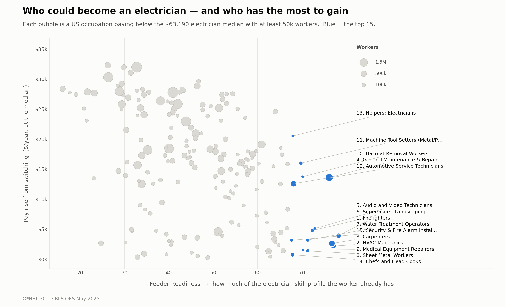
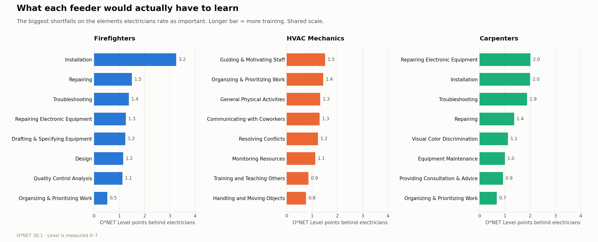

# Green-Transition Talent Feeder Index

**If building electrification and EV charging are constrained by the supply of electricians, which occupations are the most realistic pools to retrain *from*, and what exactly would each one need to learn?**

This repo builds a measure that answers both halves of that question from public data, and ranks every US occupation as a potential feeder into the electrical trade.



---

## The index in plain language

Every occupation gets two numbers.

**1. Feeder Readiness (0–100)** — *how much of the electrician skill profile a worker already has.*

O\*NET rates every occupation on 161 skills, kinds of knowledge, abilities, and work activities, each on a 0–7 "level" scale. We take the electrician's profile, look at what a worker in some other occupation already brings, and measure how far short they fall. A score of 100 means they already meet or beat electricians on everything the job needs. A score of 0 is the occupation furthest from the trade in the entire economy — which, for the record, is Models.

**2. Wage Gain ($/year)** — *what the worker gets for making the move.*

The electrician median is **$63,190**. Wage gain is simply that minus the occupation's own median wage. We only consider occupations where this is positive, because an occupation with no raise on offer is not a realistic feeder no matter how well the skills line up.

Then we filter to occupations with **at least 50,000 workers** — a pool too small to matter nationally isn't a policy lever — and rank by readiness.

---

## The "so what"

**The binding constraint is not a shortage of trainable people. It is that the people most ready to become electricians have the least financial reason to become one.** The top 15 feeder occupations hold **4.7 million workers — more than six times the entire current electrician workforce of 757,220.** The raw supply is not the problem. The problem is the trade-off buried in the data: readiness and wage upside are *negatively* correlated (r = −0.46). The occupations that most resemble electricians are already skilled, already reasonably paid trades, so the median top-15 feeder is looking at a raise of only **$3,910 a year** — nowhere near enough to offset the lost wages of an apprenticeship. The occupations offering a $25,000 raise are the ones that would need to be taught the job from scratch. That trade-off, not headcount, is what a workforce program has to buy its way out of — and it explains why "just recruit more apprentices" keeps underperforming. The one place where the trade-off breaks is **General Maintenance and Repair Workers**: 1.53 million people, the 4th-highest readiness score in the country, and a **$13,600** raise on the table. It is the single highest-yield retraining target in the US labor market, and it is not where recruiting is currently aimed.

---

## What each of the top feeders would actually have to learn

This is the part that makes the analysis actionable rather than descriptive. For each feeder we list the specific O\*NET elements with the largest shortfalls, measured in Level points on the 0–7 scale.



The three profiles are genuinely different curricula:

| Feeder | The gap is really about | Biggest shortfalls (Level points) |
|---|---|---|
| **Firefighters** | One narrow technical hole | Installation (3.2), Repairing (1.5), Troubleshooting (1.4) |
| **HVAC Mechanics** | *Not* technical — it's the supervisory side | Guiding & Motivating Staff (1.5), Organizing & Prioritizing Work (1.4), General Physical Activities (1.3) |
| **Carpenters** | The electrical core itself | Repairing Electronic Equipment (2.0), Installation (2.0), Troubleshooting (1.9) |

The HVAC result is the interesting one. HVAC mechanics already **meet or beat electricians on the hands-on core** — Installation, Repairing, Equipment Maintenance, Mechanical knowledge, Building & Construction. Their largest gaps are crew supervision and job planning, and the technical shortfalls that do remain are small (all ≤ 0.6 Level points, mostly Troubleshooting and Mathematics). That is a dramatically cheaper curriculum than a full apprenticeship — and it suggests the fastest route to more electricians may be a short supervisory-and-planning bridge for people who can already do the technical work.

---

## Top 15 feeder occupations

| # | Occupation | Readiness | Workers | Median wage | Gain |
|---:|---|---:|---:|---:|---:|
| 1 | Firefighters | 78.2 | 345,990 | $59,280 | +$3,910 |
| 2 | HVAC & Refrigeration Mechanics | 77.0 | 409,670 | $61,010 | +$2,180 |
| 3 | Carpenters | 76.7 | 670,090 | $60,580 | +$2,610 |
| 4 | **Maintenance & Repair Workers, General** | **76.1** | **1,529,700** | **$49,590** | **+$13,600** |
| 5 | Audio and Video Technicians | 72.8 | 70,230 | $58,100 | +$5,090 |
| 6 | Supervisors of Landscaping | 72.3 | 130,760 | $58,430 | +$4,760 |
| 7 | Water & Wastewater Treatment Operators | 71.3 | 128,490 | $60,020 | +$3,170 |
| 8 | Sheet Metal Workers | 71.3 | 119,770 | $61,800 | +$1,390 |
| 9 | Medical Equipment Repairers | 70.2 | 65,990 | $61,660 | +$1,530 |
| 10 | Hazardous Materials Removal Workers | 70.1 | 51,710 | $49,450 | +$13,740 |
| 11 | Machine Tool Setters (Metal/Plastic) | 69.7 | 124,590 | $47,180 | +$16,010 |
| 12 | Automotive Service Technicians | 68.1 | 704,640 | $50,620 | +$12,570 |
| 13 | Helpers—Electricians | 67.9 | 63,630 | $42,670 | +$20,520 |
| 14 | Chefs and Head Cooks | 67.8 | 200,040 | $62,470 | +$720 |
| 15 | Security & Fire Alarm Installers | 67.6 | 86,340 | $60,070 | +$3,120 |

Full results for all 195 candidates: [`outputs/feeder_index.csv`](outputs/feeder_index.csv). Scores for all 750 occupations: [`outputs/readiness_all_occupations.csv`](outputs/readiness_all_occupations.csv).

---

## The methodological contribution

Two choices distinguish this from a generic occupational-similarity measure.

### 1. Weight by what the *target* job needs, not by what the two jobs share

A standard similarity measure treats all 161 elements equally, which means an occupation can score well by matching electricians on things electricians barely do. We instead weight each element by **how important electricians say it is**, and drop entirely any element they rate below 3.0 — which is O\*NET's own anchor for *"Important."* That leaves **96 of 161 elements**.

The threshold isn't a tuned parameter; it's the instrument's own word for the concept we want. The effect is to measure *readiness for this specific job* rather than *general resemblance between two jobs*. Someone can be a poor overall match for electricians and still be an excellent feeder, as long as the mismatch is on things the job doesn't need.

### 2. Count shortfalls only — never penalise an over-qualified worker

This is the choice that matters most. If a machinist is *better* than an electrician at precision measurement, that is not a barrier to becoming an electrician. It's an asset, or at worst irrelevant. Only the elements where a candidate falls **short** represent training that has to actually happen.

So the distance is one-sided: for each element we take `max(0, electrician_level − candidate_level)` and ignore the rest. A conventional symmetric distance (Euclidean, cosine) would punish an occupation for exceeding the target — which would be a defensible way to measure *similarity* and an indefensible way to measure *readiness*. Concretely: HVAC mechanics score **5.93** on Mechanical knowledge against the electrician's **3.41**. A symmetric measure would read that 2.5-point surplus as 2.5 points of *distance* and push one of the best feeders in the country down the list. Here it correctly counts as zero barrier. This also means the measure produces the curriculum for free: the elements driving the distance *are* the training plan.

Formally, readiness is the importance-weighted root-mean-square shortfall across the 96 elements, computed on z-scored levels (so an element with a wide spread across occupations isn't drowned out by one with a narrow spread), then rescaled 0–100 against the least-ready occupation in the economy.

**One consequence worth knowing:** the index measures *skill level already held*, not *ease of entry*. That's why Helpers—Electricians ranks 13th rather than 1st — helpers work beside electricians daily, but the whole point of the role is that they haven't yet acquired the levels. If your question is "who converts fastest," adjacency and licensure matter too, and this index doesn't capture them.

---

## Reproducing it

```bash
pip install -r requirements.txt && python3 build_index.py
```

One script, no API keys, ~30 seconds. Both datasets download automatically on first run (~14 MB) into `data/raw/`.

| Source | What it provides | Vintage |
|---|---|---|
| [O\*NET Database 30.1](https://www.onetcenter.org/database.html) | Skills, Knowledge, Abilities, Work Activities — Importance & Level by SOC | 2026 |
| [BLS OES National](https://www.bls.gov/oes/tables.htm) | Employment and median wages by occupation | May 2025 |

Every judgment call is a named constant in the first 40 lines of [`build_index.py`](build_index.py) — the target occupation, the importance threshold, the employment floor. Point `TARGET_SOC` at a different job and the whole analysis re-runs for that trade.

**Joining note.** O\*NET is keyed to 8-digit O\*NET-SOC codes and OES to 6-digit SOC, so O\*NET ratings are averaged up to the 6-digit level; 750 occupations carry both skill and wage data. BLS "All Other" residual categories are dropped — they're heterogeneous by construction, so no single skill profile describes them and no curriculum can target them.

---

## Limitations

This is a demonstration of a method, not a finished labor-market study.

- **No projections.** The full design filters to occupations with flat or declining projected growth — workers with a *reason* to move. That's the third leg and it isn't here yet; the current filters find who *could* move, not who *would*.
- **National only.** Electrician demand is intensely local. State-level OES data is the obvious next cut, and it's the same script with a different input file.
- **No composite.** Readiness and wage gain are reported separately and the ranking is on readiness alone. Combining them into one score requires taking a position on how to trade them off, which is a real decision and shouldn't be smuggled in.
- **Licensure is invisible.** O\*NET measures skills, not the apprenticeship hours and state licensing that actually gate this trade. The index says who is *capable*, not who is *permitted*.
- **Face validity is good but not perfect.** HVAC, carpenters, sheet metal, and automotive techs all land where a tradesperson would expect. Firefighters at #1 is defensible (strong overlap on physical, diagnostic, and equipment abilities, and it's a well-documented real-world transition) but should raise an eyebrow. Chefs and Head Cooks at #14 is the clearest artifact — high on manual dexterity, equipment handling, and working under pressure, with none of the electrical content. Both are useful reminders that a skills-similarity measure with no domain-knowledge floor will occasionally reach.

### What the full build adds

BLS Employment Projections for the "reason to move" filter, a defensible composite over proximity × wage gain × pool size, state-level cuts, and a knowledge-domain floor to suppress the Chefs-type artifact.
